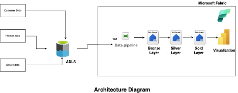

# Real-World Project Case Study
## Introduction to the Problem

Our client, Binaryville, is a multinational retailer operating in 27 countries, with over 11,000 stores and a strong e-commerce presence. Because they generate enormous amounts of data daily, they face challenges in consolidating and analyzing it efficiently, which leads to missed business opportunities and operational inefficiencies.

## Business Need

Binaryville requires a solution that can:

Consolidate data from both in-store and online channels across multiple countries.
Process vast amounts of historical and real-time transactional data.
Enable accurate, company-wide analytics to drive better decision-making.
Scale to meet future growth and potential acquisitions.
## Data Sources

We will work with three key data sources:

Customer data: CSV files from their CRM system, updated daily (500 million records)
Product catalog: JSON files from their inventory management system (one million SKUs)
Transaction history: Parquet files from POS and e-commerce platforms (10 billion transactions annually)
## Expected Outcomes

The implementation of this solution aims to:

Reduce data processing time from 72 hours to under 6 hours.
Increase inventory forecasting accuracy by 25%.
Boost customer personalization efforts, leading to a 15% increase in repeat purchases.
Enable real-time financial reporting across all regions.
## Challenges

Key challenges include:

Poor data quality, especially in older records and data from recent acquisitions
Variations in data formats and schemas across regions
Processing and analyzing 5 years of historical data alongside daily updates
Complex ETL processes due to differing currencies, time zones, and regional product codes
Minimizing disruptions to existing operations during implementation
## Solution Approach Using Microsoft Fabric

We will implement a data lakehouse architecture using Microsoft Fabric to address these challenges. Here's how:

### 1. Data Ingestion (Bronze Layer):

Set up automated daily ingestion of CSV, JSON, and Parquet files into the Bronze Layer of Microsoft Fabric’s Lakehouse.
Use Fabric Pipelines to automate ingestion processes.
### 2. Data Processing (Silver Layer):

Clean and standardize data using Microsoft Fabric Dataflows, addressing data quality issues.
Normalize data across regions (such as currency conversion, time zone alignment) using Fabric Transformation Activities.
Leverage Delta Lake features in Fabric for ACID transactions and schema evolution.
### 3. Data Modeling (Gold Layer):

Create a unified customer view across all regions using Fabric's Power BI Data Model.
Standardize product categorization and develop aggregated sales and inventory models.
### 4. Batch Processing:

Design efficient Spark jobs within Microsoft Fabric’s Spark Engine for processing daily incremental loads.
### 5. Analytics and Reporting:

Connect Power BI to Microsoft Fabric to create real-time dashboards for different business units (sales, finance, inventory, marketing).

## Data Lakehouse – High-Level Solution
A data lakehouse blends the best features of a data lake and a data warehouse, offering:

The scalability and flexibility of a data lake

The structure, data management, and ACID transactions of a data warehouse

Support for diverse data types and workloads

In the context of Binaryville, this means we can handle large, varied datasets while maintaining the structure needed for real-time analytics and reporting. Using Microsoft Fabric, this architecture will allow Binaryville to ingest, process, and analyze massive amounts of data efficiently.

Our solution will follow a three-layer architecture in Microsoft Fabric:

### 1. Bronze Layer: Raw data ingestion

Stores data in its delta table format from respective files (CSV, JSON, Parquet).
Preserves the entire history of data changes for reprocessing.
### 2. Silver Layer: Cleaned and conformed data

Applies data quality rules like deduplication and standardization using Microsoft Fabric Notebooks.
### 3, Gold Layer: Business-level aggregates

Applies aggregations and business logic to prepare the data for reporting.
Ensures high query performance using Microsoft Fabric Lakehouse features.
This layered architecture helps us maintain data integrity at every stage while progressively refining the data for analytical needs.

## Fabric End-to-End Project Architecture Diagram
The architecture for the project is as follows:

A diagram showing customer data, product data, and orders data getting fed into an ADLS. This then outputs the data pipeline, into a bronze, silver, and gold layer which outputs the visualization.

Microsoft Fabric provides the data pipeline, spark notebook, and visualization in one common platform, hence in the above architecture all the steps are coming within it.