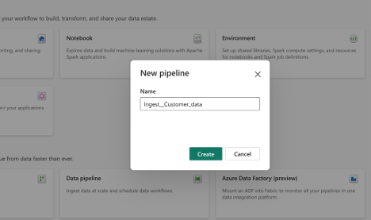
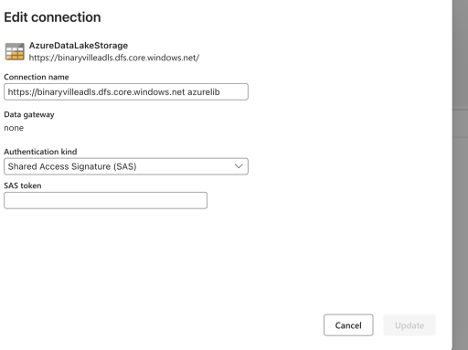

# 1. Fabric Project Setup
## 1. Fabric Workspace Creation
In this section, we will go through the step-by-step process of creating a Microsoft Fabric Workspace for Binaryville’s data lakehouse solution. The workspace is the foundational environment where all data engineering, data analytics, and reporting tasks will take place.

Before we create the workspace, ensure the following requirements are met:

Microsoft Fabric Subscription: Ensure you have an active subscription or trial for Microsoft Fabric.

#### 1. Log in to Microsoft Fabric

Go to the Microsoft Fabric portal and log in using your Azure credentials with the necessary permissions.
#### 2. Navigate to the Workspaces Section

Once logged in, select Workspaces from the left-hand menu. This is where all new and existing workspaces can be managed.
#### 3. Create a New Workspace

Click Create Workspace.
Provide a name for the workspace, such as Binaryville.
Provide a description for the workspace, such as Binaryville lakehouse.
This will create the workspace for the Microsoft Fabric.

## 2. Introduction to Azure Data Lake Storage (ADLS)
Now that we have our Fabric workspace, let’s introduce Azure Data Lake Storage (ADLS), the backbone of our data lakehouse architecture. ADLS provides scalable, secure, and cost-effective storage for Binaryville’s massive datasets, allowing us to store, manage, and analyze large volumes of structured and unstructured data.

Azure Data Lake Storage (ADLS) is a highly scalable and secure cloud storage service designed to store and process large volumes of data. It combines the capabilities of Azure Blob Storage with advanced big data analytics capabilities, enabling us to handle a wide variety of data formats, including CSV, JSON, Parquet, and more.

**Key features of ADLS include:**

**Scalability**: Can handle petabytes of data, making it ideal for Binaryville’s massive data volumes
Security: Offers robust security features like role-based access control (RBAC), encryption at rest, and secure data transfer
**Cost-Effectiveness**: Allows for tiered storage to manage data at different levels of access and cost
For Binaryville, Azure Data Lake Storage provides the following advantages:

**Centralized Data Storage**: ADLS enables us to store all of Binaryville’s data—both structured and unstructured—in a single, centralized repository.
**Support for Multiple Data Types**: It supports various data formats, including CSV, JSON, and Parquet, which are essential for handling Binaryville’s customer, product, and transaction data.
**Scalability and Flexibility**: As Binaryville continues to grow, ADLS will scale seamlessly to accommodate their expanding data needs.
**Integration with Azure Services**: ADLS integrates tightly with Microsoft Fabric, Power BI, and other Azure services, enabling efficient data processing and analytics.
**Hierarchical Namespace:**
ADLS provides a hierarchical namespace, which allows for a structured and organized way to store and manage data. This feature enables efficient file and directory operations, reducing the complexity of managing large datasets.
**Access Tiers:**
ADLS supports different access tiers (Hot, Cool, Archive), allowing us to manage data costs effectively. Frequently accessed data is stored in the Hot tier, while older, less frequently accessed data can be moved to the Cool or Archive tier.
**Data Security:**
With RBAC, Shared Access Signatures (SAS), and encryption at rest, ADLS ensures that Binaryville’s data is securely stored and accessed by authorized users only.
To set up Azure Data Lake Storage for Binaryville, follow these steps:

#### 1. Create an ADLS Account:

In the Azure portal, navigate to Storage Accounts and click Create.
Provide the required details, such as subscription, resource group, and region.
#### 2. Configure Data Containers:

Create the container named landing where the data for customer, product and orders is going to be ingested.

## 3. Load Customer Data into Azure Data Lake Storage (ADLS)
We have our ADLS set up. Now let’s focus on the step-by-step process of loading customer data into Azure Data Lake Storage (ADLS). This is an essential step in our data lakehouse architecture, as it allows Binaryville to store large volumes of raw customer data, which will later be processed and transformed for analytics.

Before loading data into ADLS, ensure the following:

Customer Data: Ensure that the customer data file (for example, customer.csv) is available and ready for upload; this file typically comes from the CRM system and contains essential customer information
Access to ADLS: You must have appropriate permissions to upload files to the designated ADLS account
#### 1. Log in to Azure Portal

Navigate to the Azure portal and sign in with your Azure credentials. Ensure that you have the necessary permissions to access and manage the ADLS account.
#### 2. Navigate to the ADLS Account

In the Azure portal, search for your Azure Data Lake Storage account by typing "{name_of_your_adls_account}" in the search bar.
Select the ADLS account that will hold the customer data.
Once inside the account, navigate to the Containers section, where your data will be stored.
#### 3. Use an Existing Container

Select the existing landing container to upload the raw customer data.
Locate the customer data file on your local machine (such as customer.csv) and upload.
#### 4. Verify the Upload

After the file is uploaded, verify the file’s presence.
Check that the file size, format, and contents match what you uploaded.

## 4. Load Product Data into Azure Data Lake Storage (ADLS)
Similar to loading the customer data, let’s load Product data into Azure Data Lake Storage (ADLS).

Before loading data into ADLS, ensure the following:

Product data: Ensure that the product data file (such as product.json) is available and ready for upload. This file typically comes from the product catalog system and contains essential product information. (You can find sample file in the exercise folder)
Access to ADLS: You must have appropriate permissions to upload files to the designated ADLS account
#### 1. Log in to Azure Portal

Navigate to the Azure portal and sign in with your Azure credentials. Ensure that you have the necessary permissions to access and manage the ADLS account
#### 2. Navigate to the ADLS Account

In the Azure portal, search for your Azure Data Lake Storage account by typing "{name_of_your_adls_account}" in the search bar.
Select the ADLS account that will hold the Product data.
Once inside the account, navigate to the Containers section, where your data will be stored.
#### 3. Use an Existing Container

Select the existing landing container to upload the raw product data.
Locate the product data file on your local machine (such as product.json) and upload.
#### 4. Verify the Upload

After the file is uploaded, verify the file’s presence.
Check that the file size, format, and contents match what you uploaded.

## 5. Load Orders Data into Azure Data Lake Storage (ADLS)
Now that we have both customer and product data loaded, let’s load orders data into Azure Data Lake Storage (ADLS).

Before loading data into ADLS, ensure the following:

Orders Data: Ensure that the orders data file (for example, transactions.snappy.parquet) is available and ready for upload. This file typically comes from the POS system and contains essential orders information. (You can find sample file in the exercise folder)
Access to ADLS: You must have appropriate permissions to upload files to the designated ADLS account
#### 1. Log in to Azure Portal

Navigate to the Azure portal and sign in with your Azure credentials. Ensure that you have the necessary permissions to access and manage the ADLS account.
#### 2. Navigate to the ADLS Account

In the Azure portal, search for your Azure Data Lake Storage account by typing "{name_of_your_adls_account}" in the search bar.
Select the ADLS account that will hold the Orders data.
Once inside the account, navigate to the Containers section, where your data will be stored.
#### 3. Use an Existing Container

Select the existing landing container to upload the raw orders data.
Locate the orders data file on your local machine (such as transactions.snappy.parquet) and upload.
#### 4. Verify the Upload

After the file is uploaded, verify the file’s presence.
Check that the file size, format, and contents match what you uploaded.

# 2. Fabric's Bronze Layer Implementation

## 1. Create Bronze Layer Lakehouse
In this chapter, we will focus on setting up our medallion layers in our lakehouse. Let’s start with the Bronze layer lakehouse in Microsoft Fabric. The Bronze layer is where raw data is ingested and stored without any transformations. This step is foundational for building the data lakehouse architecture, as the Bronze layer will hold unprocessed data that will be transformed in subsequent Silver and Gold layers.

Here, we will only cover the process of creating the Bronze lakehouse. Loading data into the lakehouse will be covered in the following sections of this chapter.

The Bronze layer is the raw data storage tier in a data lakehouse architecture. It stores data in its original format (CSV, JSON, Parquet, etc.) as it is ingested from various sources. The purpose of the Bronze layer is to ensure that all raw data is stored securely and in an organized manner, ready for future processing.

Key features of the Bronze layer:

Raw data storage: Data is stored in its original form, without any cleansing or transformation
High-volume ingestion: Designed to handle large volumes of data from multiple sources
Immutable: Data is stored in its raw state, preserving the full history of changes
Data integrity: The Bronze layer ensures that data is stored securely and consistently for future processing

### Step-by-Step Guide to Creating the Bronze Layer Lakehouse
#### 1. Log in to Microsoft Fabric

Start by logging in to the Microsoft Fabric portal using your Azure credentials.
#### 2. Navigate to the Data Lakehouse Section

In the Fabric portal, navigate to Lakehouse under the Workspaces section.
This is where you will create and manage the Bronze layer for the data lakehouse.
#### 3. Create the Bronze Lakehouse

Click on Create Lakehouse and select the option to create a new lakehouse specifically for the Bronze layer.
Name the lakehouse BronzeLayer to clearly identify its purpose as the raw data storage layer.

## 2. Create a Pipeline to Load Customer Data
Now let’s create a pipeline to ingest customer data into the Bronze layer lakehouse in Microsoft Fabric. This pipeline will automate the process of loading raw customer data from various sources into the lakehouse. The data will be stored in its original format and organized for future transformations in the Silver and Gold layers.

Before creating the pipeline, ensure the following:

Customer Data: Raw customer data should be available in CSV format in ADLS account
Bronze Layer Lakehouse: The Bronze layer lakehouse has been created in Microsoft Fabric (as discussed in the previous chapter)
Microsoft Fabric Pipelines: You should have access to data factory in Microsoft Fabric to build and automate the pipeline
#### 1. Log in to Microsoft Fabric

Log into the Microsoft Fabric portal using your Azure credentials.
#### 2. Navigate to Data factory experience

Click on Data pipeline.
#### 3. Create a New Pipeline

##### 3.1 Give it a name, such as “Ingest_Customer_data.”

##### 3.2 Add the Copy Activity

- In the pipeline editor, add the Copy Data Activity and configure the properties of it

- Click on Source -> Connection -> more

- Under the data source select Azure data lake storage gen 2.

- Provide the connection settings for it.

Choose the ADLS account URL (ensure path has dfs.core.windows.net).
Choose authentication as SAS.
Provide the SAS token.
Click connect.

- Select the File path up to the CSV file.

- Select the file format as delimited text.

- Select Destination tab.

- Select Connection -> BronzeLayer.

- Select the Table option and select New.

- Give the name of the table as Customer.

##### 3.3 On the top select the run tab and run the pipeline.

- Pipeline executed successfully and load the data in bronzelayer lakehouse.

## 3. Create a Pipeline to Load Product Data
Similar to the customer data, let’s now create a pipeline to ingest Product data into the Bronze layer lakehouse in Microsoft Fabric. This pipeline will automate the process of loading raw Product data from various sources into the lakehouse. The data will be stored in its original format and organized for future transformations in the Silver and Gold layers.

Before creating the pipeline, ensure the following:

Product data: Raw Product data should be available in JSON format in ADLS account
Bronze layer lakehouse: The Bronze layer lakehouse has been created in Microsoft Fabric (as discussed in the previous chapter)
Microsoft Fabric pipelines: You should have access data factory in Microsoft Fabric to build and automate the pipeline
#### 1. Log in to Microsoft Fabric

Log into the Microsoft Fabric portal using your Azure credentials.
#### 2. Navigate to Data factory experience

Click on Data pipeline.
#### 3. Create a New Pipeline

3.1 Give it a name, such as “Ingest_Product_data.”

3.2 Add the Copy Activity

- In the pipeline editor, add the Copy Data Activity and configure the properties of it,

- Click on Source-> Connection-> bineryville (ADLS connection created for previous customer pipeline).

- Select the File path up to the JSON file.

- Select the file format as JSON.

- Select Destination tab.

- Select Connection -> BronzeLayer.

- Select the Table option and select New.

- Give the name of the table as Product.

 

3.3 On the top select the run tab and run the pipeline.

- Pipeline executed successfully and load the data in bronzelayer lakehouse.

## 5. Verify Customer Data in the Bronze Layer Lakehouse
With our data ingested into the pipeline, we will now focus on verifying that customer data has been successfully ingested into the Bronze layer lakehouse.

#### 1. Log in to Microsoft Fabric

Log into the Microsoft Fabric portal using your Azure credentials and navigate to the Bronze layer lakehouse.
#### 2. Open the BronzeLayer lakehouse from the left navigation

In the Lakehouse Explorer, open the tables.
Click on the customer. On the right side, you will start seeing the table data.

## 6. Verify Product Data in the Bronze Layer Lakehouse
Similar to the customer data, let’s verify that Product data has been successfully ingested into the Bronze layer lakehouse.

#### 1. Log in to Microsoft Fabric.

Log into the Microsoft Fabric portal using your Azure credentials and navigate to the Bronze layer lakehouse.
#### 2. Open the BronzeLayer lakehouse from the left navigation.

In the Lakehouse Explorer, open the tables.
Click on the Product. On the right side, you will see the table data.

## 7. Verify Orders Data in the Bronze Layer Lakehouse
Similar to the product data, let’s verify that Orders data has been successfully ingested into the Bronze layer lakehouse.

#### 1. Log in to Microsoft Fabric.

Log into the Microsoft Fabric portal using your Azure credentials and navigate to the Bronze layer lakehouse.
#### 2. Open the BronzeLayer lakehouse from the left navigation.

In the Lakehouse Explorer, open the tables.
Click on the Orders. On the right side, you will see the table data.

# 3. Fabric's Silver Layer Implementation
## 1. Create Silver Layer Lakehouse
Now that data has been ingested into the Bronze layer lakehouse, let’s focus on setting up the Silver layer lakehouse in Microsoft Fabric. The Silver layer is where clean and transformed data is stored.

In this chapter, we will only cover the process of creating the Silver lakehouse. Loading data into the lakehouse will be covered in the following chapters.

#### 1. Log in to Microsoft Fabric.

Start by logging in to the Microsoft Fabric portal using your Azure credentials.
#### 2. Navigate to the Data Lakehouse section.

In the Fabric portal, navigate to Lakehouse under the Workspaces section.
This is where you will create and manage the Silver layer for the data lakehouse.
#### 3. Create the Silver Lakehouse.

Click on Create Lakehouse and select the option to create a new lakehouse specifically for the Silver layer.
Name the lakehouse SilverLayer to clearly identify its purpose as the processed data storage layer.

## 2. Create a Notebook to Load Customer Data into the Silver Layer
Now, let’s focus on creating a notebook to load and transform customer data into the Silver layer of the data lakehouse. The Silver layer is where raw data from the Bronze layer is cleaned, standardized, and prepared for analytical processing. We'll also address specific data cleaning and transformation requirements, such as validating customer information, categorizing customer segments, and ensuring data quality by removing junk records.

Before we proceed with the notebook creation, here are the specific data cleaning and transformation rules for the customer data in the Silver layer:

***1. Validate email addresses:*** Ensure that the email column contains valid, non-null values.

***2. Validate age:*** Filter customers with ages between 18 and 100 years.

***3. Customer segmentation:*** Create a new column, customer_segment, where:

- High Value if total purchases are greater than 10,000.
- Medium Value if total purchases are greater than 5,000 but less than or equal to 10,000.
- Low Value if total purchases are less than or equal to 5,000.
  
***4. Calculate days since registration:*** Create a column for the number of days since the customer registered in the system.

***5. Remove invalid records:*** Filter out any records where the total_purchases is a negative number, as these represent junk data.

***Step-by-Step Guide to Creating the Notebook for the Silver Layer***
##### 1. Log in to Microsoft Fabric.

Start by logging in to the Microsoft Fabric portal using your Azure credentials.

##### 2. Navigate to the Lakehouse workspace.

In the Lakehouse workspace, open the Silver layer where the cleaned and transformed data will be stored.

##### 3. Create a new notebook.

In the Lakehouse environment, create a new PySpark notebook for loading and transforming customer data from the Bronze layer.

Name the notebook Silverlayer_Csutomer_load.

##### 4. Create the Silver layer table for customer data

This table will store the cleaned and transformed customer data in the Silver layer.

spark.sql("""
    CREATE TABLE IF NOT EXISTS silver_customers (
    customer_id STRING,
    name STRING,
    email STRING,
    country STRING,
    customer_type STRING,
    registration_date DATE,
    age INT,
    gender STRING,
    total_purchases INT,
    customer_segment STRING,
    days_since_registration INT,
    last_updated TIMESTAMP)
""")
Created the notebook for customer data load in silver layer.

##### 5. Identify last processed timestamp.

Get the timestamp of the last processed record to load only new or updated data.

last_processed_df = spark.sql("SELECT MAX(last_updated) as last_processed FROM silver_customers")
last_processed_timestamp = last_processed_df.collect()[0]['last_processed']

if last_processed_timestamp is None:
    last_processed_timestamp = "1900-01-01T00:00:00.000+00:00"
##### 6. Load incremental data from the Bronze layer.

Create a temporary view of newly ingested customer data from the Bronze layer by filtering data based on the last processed timestamp.

Create a temporary view of incremental bronze data

spark.sql(f"""
CREATE OR REPLACE TEMPORARY VIEW bronze_incremental AS
SELECT *
FROM bronzelayer.customer c where  c.ingestion_timestamp > '{last_processed_timestamp}'
""")

##### 7. Transform the customer data.

Apply the required transformations: email validation, validate age, calculate days since registration and remove invalid records.

spark.sql("""
CREATE OR REPLACE TEMPORARY VIEW silver_incremental AS
SELECT
    customer_id,
    name,
    email,
    country,
    customer_type,
    registration_date,
    age,
    gender,
    total_purchases,
    CASE
        WHEN total_purchases > 10000 THEN 'High Value'
        WHEN total_purchases > 5000 THEN 'Medium Value'
        ELSE 'Low Value'
    END AS customer_segment,
    DATEDIFF(CURRENT_DATE(), registration_date) AS days_since_registration,
    CURRENT_TIMESTAMP() AS last_updated
FROM bronze_incremental
WHERE 
    age BETWEEN 18 AND 100
    AND email IS NOT NULL
    AND total_purchases >= 0
""")
##### 8. Merge data into the Silver layer

Use the MERGE command to upsert the transformed data into the Silver layer, ensuring that both new and updated records are handled correctly.

spark.sql("""
MERGE INTO silver_customers target
USING silver_incremental source
ON target.customer_id = source.customer_id
WHEN MATCHED THEN
    UPDATE SET *
WHEN NOT MATCHED THEN
    INSERT *
""")
##### 9. Verify the data in the Silver layer.

Once the data is written, verify the contents of the Silver layer.

Read and verify the Silver layer customer data
spark.sql("select count(*) from silver_customers").show()
Verify the customer data in silver layer.

***Final Thoughts***
Creating a notebook to load and transform customer data into the Silver layer is a critical step in preparing the data for analysis. By applying data cleaning and validation rules, we ensure that only high-quality, standardized data moves through the data lakehouse. This notebook also enables the categorization of customer segments and the removal of junk records, making the data more usable for business analytics.

## 3. Create a Notebook to Load Product Data into the Silver Layer
Now, we will create a notebook to load and transform product data from the Bronze layer into the Silver layer of the data lakehouse. The Silver layer ensures that raw data is cleansed and standardized for analytical purposes. The data transformations for product data include price normalization, stock quantity adjustments, rating clamping, price categorization, and stock status calculation.

The following transformations will be applied to product data.

***1. Price Normalization:*** Convert any negative prices to 0 to prevent invalid product prices.

***2. Stock Quantity Normalization:*** Convert negative stock quantities to 0 to ensure no invalid stock levels.

***3. Rating Normalization:*** Clamp the product rating between 0 and 5 to ensure valid ratings.

***4. Price Categorization:*** Categorize products based on price into Premium, Standard, or Budget categories.

***5. Stock Status Calculation:*** Determine the stock status based on quantity.

Out of Stock if stock is 0
Low Stock if stock is less than 10
Moderate Stock if stock is between 10 and 50
Sufficient Stock for quantities greater than 50
##### 1. Log in to Microsoft Fabric.

Start by logging in to the Microsoft Fabric portal using your Azure credentials.

##### 2. Navigate to the Lakehouse workspace.

Open the Silver layer of your lakehouse in the workspace to prepare for data transformation.

##### 3. Create a new notebook.

Create a new PySpark notebook in the Silver layer workspace, and name it Silverlayer_product_load.

##### 4. Create the Silver layer table for product data

This table will store the cleaned and transformed product data in the Silver layer.

spark.sql("""
CREATE TABLE IF NOT EXISTS silver_products (
    product_id STRING,
    name STRING,
    category STRING,
    brand STRING,
    price DOUBLE,
    stock_quantity INT,
    rating DOUBLE,
    is_active BOOLEAN,
    price_category STRING,
    stock_status STRING,
    last_updated TIMESTAMP
)
USING DELTA
""")
Created the notebook for product data load in silver layer.

##### 5. Identify last processed timestamp.

Get the timestamp of the last processed record to load only new or updated data.

last_processed_df = spark.sql("SELECT MAX(last_updated) as last_processed FROM silver_products")
last_processed_timestamp = last_processed_df.collect()[0]['last_processed']

if last_processed_timestamp is None:
    last_processed_timestamp = "1900-01-01T00:00:00.000+00:00"
##### 6. Load incremental data from the Bronze layer.

Create a temporary view of newly ingested product data from the Bronze layer by filtering data based on the last processed timestamp.

spark.sql(f"""
CREATE OR REPLACE TEMPORARY VIEW bronze_incremental_products AS
SELECT *
FROM bronzelayer.product WHERE ingestion_timestamp > '{last_processed_timestamp}'
""")
##### 7. Transform the product data.

Apply the required transformations: price normalization, stock quantity adjustments, rating normalization, price categorization, and stock status calculation.

spark.sql("""
CREATE OR REPLACE TEMPORARY VIEW silver_incremental_products AS
SELECT
    product_id,
    name,
    category,
    brand,
    CASE
        WHEN price < 0 THEN 0
        ELSE price
    END AS price,
    CASE
        WHEN stock_quantity < 0 THEN 0
        ELSE stock_quantity
    END AS stock_quantity,
    CASE
        WHEN rating < 0 THEN 0
        WHEN rating > 5 THEN 5
        ELSE rating
    END AS rating,
    is_active,
    CASE
        WHEN price > 1000 THEN 'Premium'
        WHEN price > 100 THEN 'Standard'
        ELSE 'Budget'
    END AS price_category,
    CASE
        WHEN stock_quantity = 0 THEN 'Out of Stock'
        WHEN stock_quantity < 10 THEN 'Low Stock'
        WHEN stock_quantity < 50 THEN 'Moderate Stock'
        ELSE 'Sufficient Stock'
    END AS stock_status,
    CURRENT_TIMESTAMP() AS last_updated
FROM bronze_incremental_products
WHERE name IS NOT NULL AND category IS NOT NULL
""")
##### 8. Merge data into the Silver layer.

Use the MERGE command to upsert the transformed data into the Silver layer, ensuring that both new and updated records are handled correctly.

spark.sql("""
MERGE INTO silver_products target
USING silver_incremental_products source
ON target.product_id = source.product_id
WHEN MATCHED THEN
    UPDATE SET *
WHEN NOT MATCHED THEN
    INSERT *
""")
##### 9. Verify the data in the Silver layer.

After loading the transformed data into the Silver layer, you can verify the data by querying the silver_products table.

spark.sql("SELECT * FROM silver_products LIMIT 10").show()
Verify the product data in silver layer.

Verify the product data in silver layer.

Final Thoughts
This notebook transforms product data from the Bronze layer into the Silver layer, ensuring the data is clean, standardized, and ready for analysis. By applying key transformations such as price and stock normalization, rating adjustments, and categorizing products based on price and stock levels, we prepare the data for the next stage of analysis in the Gold layer.

## 4. Create a Notebook to Load Order Data into the Silver Layer
Now that we have the customer and product notebooks finished, let’s create a notebook to load and transform order data from the Bronze layer into the Silver layer of the data lakehouse. The Silver layer is responsible for preparing raw data from the Bronze layer for further analysis. For order data, the transformations include normalizing quantity and total amounts, ensuring consistent date formats, deriving order status, and performing data quality checks to filter out invalid records.

The following transformations will be applied to the order data before it is loaded into the Silver layer.

***1. Quantity and Total Amount Normalization:*** Set any negative values for quantity or total_amount to 0.

***2. Date Casting:*** Ensure the transaction_date is consistently formatted as a valid date.

***3. Order Status Derivation:*** Derive the order_status based on the quantity and total_amount. For example:

Cancelled if quantity = 0 and total_amount = 0
Completed if quantity > 0 and total_amount > 0
In Progress if other conditions are met.
***4. Data Quality Checks:*** Filter out records with null values in critical fields, such as transaction_date, customer_id, or product_id.

##### 1. Log in to Microsoft Fabric.

Start by logging in to the Microsoft Fabric portal using your Azure credentials.

##### 2. Navigate to the Lakehouse workspace.

Open the Silver layer workspace where the cleaned and transformed order data will be stored.

##### 3. Create a new notebook.

Create a new PySpark notebook for transforming order data in the Silver layer and name it Silverlayer_orders_load.

##### 4. Create the Silver layer table for orders data.

Create a table in the Silver layer for storing the transformed order data.

spark.sql("""
CREATE TABLE IF NOT EXISTS silver_orders (
    order_id STRING,
    customer_id STRING,
    product_id STRING,
    quantity INT,
    total_amount DOUBLE,
    transaction_date DATE,
    order_status STRING,
    last_updated TIMESTAMP
)
USING DELTA
""")
Created the notebook for orders data load in silver layer.

##### 5. Identify last processed timestamp.

Get the timestamp of the last processed record to load only new or updated data.

last_processed_df = spark.sql("SELECT MAX(last_updated) as last_processed FROM silver_orders")
last_processed_timestamp = last_processed_df.collect()[0]['last_processed']

if last_processed_timestamp is None:
    last_processed_timestamp = "1900-01-01T00:00:00.000+00:00"
##### 6. Load incremental data from the Bronze layer.

Create a temporary view of the newly ingested order data from the Bronze layer by filtering records based on the last processed timestamp.

spark.sql(f"""
CREATE OR REPLACE TEMPORARY VIEW bronze_incremental_orders AS
SELECT *
FROM bronzelayer.orders WHERE ingestion_timestamp > '{last_processed_timestamp}'
""")
##### 7. Transform the order data.

Apply the required transformations to clean and standardize the data.

spark.sql("""
CREATE OR REPLACE TEMPORARY VIEW silver_incremental_orders AS
SELECT
    transaction_id as order_id,
    customer_id,
    product_id,
    CASE
        WHEN quantity < 0 THEN 0
        ELSE quantity
    END AS quantity,
    CASE
        WHEN total_amount < 0 THEN 0
        ELSE total_amount
    END AS total_amount,
    CAST(transaction_date AS DATE) AS transaction_date,
    CASE
        WHEN quantity = 0 AND total_amount = 0 THEN 'Cancelled'
        WHEN quantity > 0 AND total_amount > 0 THEN 'Completed'
        ELSE 'In Progress'
    END AS order_status,
    CURRENT_TIMESTAMP() AS last_updated
FROM bronze_incremental_orders
WHERE transaction_date IS NOT NULL 
  AND customer_id IS NOT NULL 
  AND product_id IS NOT NULL
""")
##### 8. Merge data into the Silver layer

Use the MERGE statement to upsert the cleaned and transformed data into the Silver layer, ensuring both new and updated records are handled properly.

spark.sql("""
MERGE INTO silver_orders target
USING silver_incremental_orders source
ON target.order_id = source.order_id
WHEN MATCHED THEN
    UPDATE SET *
WHEN NOT MATCHED THEN
    INSERT *
""")
##### 9. Verify the data in the Silver layer.

After loading the data into the Silver layer, you can verify the data by querying the silver_orders table.

spark.sql("SELECT * FROM silver_orders LIMIT 10").show()
Verifying orders table data

Final Thoughts
By creating a notebook to load and transform order data into the Silver layer, you ensure that raw order data is cleansed, standardized, and ready for analysis. This process includes normalizing quantity and total amounts, deriving order statuses, and ensuring data quality by filtering out incomplete records. The result is a structured dataset in the Silver layer that is ready for further analysis in the Gold layer.

## 5. Verify Customer Data in the Silver Layer Lakehouse
Let’s now focus on verifying that customer data has been successfully ingested into the Silver layer lakehouse.

##### 1. Log in to Microsoft Fabric.

Log into the Microsoft Fabric portal using your Azure credentials and navigate to the Silver layer lakehouse.
##### 2. Open the Silverlayer lakehouse from the left navigation.

In the Lakehouse Explorer, open the tables.
Click on the silver_customers. On the right side, you will see the table data.
Verify customer data in silver layer

Verify Product Data in the Silver Layer Lakehouse
Similarly to the customer data, let’s verify that product data has been successfully ingested into the Silver layer lakehouse.

###### 1. Log in to Microsoft Fabric.

Log into the Microsoft Fabric portal using your Azure credentials and navigate to the Silver layer lakehouse.
###### 2. Open the Silverlayer lakehouse from the left navigation.

In the Lakehouse Explorer, open the tables.
Click on the silver_products. On the right side, you will see the table data.

## 6. Verify Product Data in the Silver Layer Lakehouse
Similarly to the customer data, let’s verify that product data has been successfully ingested into the Silver layer lakehouse.

##### 1. Log in to Microsoft Fabric.

Log into the Microsoft Fabric portal using your Azure credentials and navigate to the Silver layer lakehouse.
##### 2. Open the Silverlayer lakehouse from the left navigation.

In the Lakehouse Explorer, open the tables.
Click on the silver_products. On the right side, you will see the table data.

## 7. Verify Orders Data in the Silver Layer Lakehouse
Finally, let’s focus on verifying that orders data has been successfully ingested into the Silver layer lakehouse.

##### 1. Log in to Microsoft Fabric.

Log into the Microsoft Fabric portal using your Azure credentials and navigate to the Silver layer lakehouse.
##### 2. Open the SilverLayer lakehouse from the left navigation.

In the Lakehouse Explorer, open the tables.
Click on the silver_orders. On the right side, you will see the table data.

# 4. Fabric's Gold Layer Implementation

## 1. Create Gold Layer Lakehouse
In this chapter, we will focus on setting up the Gold layer lakehouse in Microsoft Fabric.

##### 1. Log in to Microsoft Fabric.

Start by logging in to the Microsoft Fabric portal using your Azure credentials.
##### 2. Navigate to the data lakehouse section.

In the Fabric portal, navigate to Lakehouse under the Workspaces section.
This is where you will create and manage the Gold layer for the data lakehouse.
##### 3. Create the Gold lakehouse.

Click on Create Lakehouse and select the option to create a new lakehouse specifically for the Gold layer.
Name the lakehouse GoldLayer to clearly identify its purpose as the raw data storage layer.

## 2. Create a Notebook to Load Gold Table: Part 1
Let’s create a notebook to load aggregated daily sales data into the Gold layer of the data lakehouse. The Gold layer is designed for business-ready data, where key metrics and summaries are derived from the cleansed data stored in the Silver layer. For this part, we will focus on aggregating sales data into a daily summary table, which will provide insights into the total sales per day for Binaryville.

The goal is to load the Gold layer with a table that aggregates the total sales amount per day. This transformation will include:

***1. Source Data:*** Pull the order data from the Silver layer (silver_orders table).
***2. Aggregation:*** Calculate the total sales (SUM(total_amount)) for each transaction_date.
***3. Output Table:*** Store the aggregated data in the Gold layer as a gold_daily_sales table.
***4. Grouping:*** The data will be grouped by transaction_date to generate the daily total sales.
##### 1. Log in to Microsoft Fabric.

- Log in to the Microsoft Fabric portal using your Azure credentials.
##### 2. Navigate to the Lakehouse workspace.

- Open the Gold layer workspace where the business-ready data will be stored.
##### 3. Create a new notebook.

- Create a new PySpark notebook for creating the Gold layer table and name it Goldlayer_DailySales.
##### 4. Create the Gold table for daily sales.

Run the following SQL code to create the gold_daily_sales table in the Gold layer. This table will aggregate total sales by transaction_date from the Silver layer.
spark.sql("""
CREATE OR REPLACE TABLE gold_daily_sales AS
SELECT 
    transaction_date,
    SUM(total_amount) AS daily_total_sales
FROM 
    SilverLayer.silver_orders
GROUP BY 
    transaction_date
""")
##### 5. Verify the Gold table.

After creating the table, you can verify that the gold_daily_sales table was created successfully and that the data has been aggregated as expected.

Verify the data in the Gold table
spark.sql("SELECT * FROM gold_daily_sales LIMIT 10").show()
Verify gold_daily_sales data in gold layer.

***Final Thoughts***
By creating the gold_daily_sales table in the Gold layer, we have successfully aggregated daily sales data from the Silver layer to provide business-ready metrics. This summary table is critical for business insights, enabling Binaryville to track daily sales performance across all transactions. In the next chapter, we will expand this process by adding metrics and tables to the Gold layer, preparing for more advanced analytics and reporting.

## 3. Create a Notebook to Load Gold Table: Part 2
Now that our aggregated sales data is loaded, we will continue building the Gold layer by creating a new table that aggregates sales data by product category. The Gold layer is designed for high-level, business-ready metrics that can be used for reporting and decision-making. For this part, we will focus on generating sales summaries based on product categories, which will help Binaryville understand how different product categories are performing in terms of total sales.

The goal is to load the Gold layer with a table that aggregates category-wise sales totals. The transformation will include:

***1. Source Data:*** Pulling data from the Silver layer tables silver_orders and silver_products.
***2. Aggregation:*** Calculating the total sales (SUM(o.total_amount)) for each product category.
***3. Output Table:*** Storing the aggregated data in the Gold layer as a gold_category_sales table.
***4. Joining:*** Joining the orders and products tables from the Silver layer to associate each sale with its respective product category.
##### 1. Log in to Microsoft Fabric.

- Log into the Microsoft Fabric portal using your Azure credentials.
##### 2. Navigate to the Lakehouse workspace.

- Open the Gold layer workspace where the business-ready data will be stored.
##### 3. Create a new notebook.

- Create a new PySpark notebook for creating the category sales table in the Gold layer and name it Goldlayer_dailysalesby category.
##### 4. Create the Gold table for category sales.

- Run the following SQL code to create the gold_category_sales table in the Gold layer. This table will aggregate total sales by product category by joining the silver_orders and silver_products tables from the Silver layer.
  
spark.sql("""
CREATE OR REPLACE TABLE gold_category_sales AS
SELECT 
    p.category AS product_category,
    SUM(o.total_amount) AS category_total_sales
FROM 
    Silverlayer.silver_orders o
JOIN 
    Silverlayer.silver_products p ON o.product_id = p.product_id
GROUP BY 
    p.category
""")
##### 5. Verify the Gold table.

- After creating the table, you can verify that the gold_category_sales table was created successfully and that the data has been aggregated by product category.

Verify the data in the Gold table
spark.sql("SELECT * FROM gold_category_sales LIMIT 10").show()
Verify gold_category_sales data in gold layer.

***Final Thoughts***
By creating the gold_category_sales table in the Gold layer, we have successfully aggregated sales data by product category from the Silver layer. This allows Binaryville to track the performance of different product categories and make data-driven decisions about inventory management, marketing, and pricing strategies.

# 5. Fabric's PowerBI Data Visualization

## 1. Create a Semantic Model
In this chapter, we will focus on creating a semantic model for the Gold layer of the data lakehouse.

***Create semantic model*** that uses both the tables from the Gold layer.
##### 1. Log in to Microsoft Fabric.

- Log in to the Microsoft Fabric portal using your Azure credentials.
##### 2. Define key business metrics.

- Open the GoldLayer lakehouse.
- On the top, click on the New semantic model tab.
##### 3. Provide the details.

- Fill details to create the semantic model.

##### 4. Click confirm to create the model.

##### 5. The model will be created, and it will look like this:

## 2. Create a Power BI Dashboard Report
Now that our semantic model is created, let’s create a Power BI dashboard report that visualizes the business metrics derived from the Gold layer of the data lakehouse. Power BI is an industry-leading business analytics tool that enables users to create insightful, interactive reports and dashboards by connecting to various data sources, including our semantic model built in the previous chapter. The goal is to present key metrics like daily sales, category sales, and total revenue in a visually compelling and interactive format for business decision-makers.

To create the Power BI dashboard, we will:

***1. Connect to the Gold layer:*** Pull data directly from the Gold layer or the semantic model we created in the last chapter.
***2.Visualize business metrics:*** Use various Power BI visuals such as line charts, bar charts, and KPIs to represent metrics like daily sales, category sales, and total revenue.
##### 1. Log in to Microsoft Fabric.

- Log in to the Microsoft Fabric portal using your Azure credentials.
##### 2. Open semantic model created in previous step.

##### 3. Create report.

- Click on the create new report to create Power BI report:
Create new report

##### 4. Create visualizations for key metrics.

- Use the data from the Gold layer to build the visualizations. 

Visualization for the Binaryville 

By creating a Power BI dashboard, you have provided business users with a powerful tool to visualize and interact with key metrics such as daily sales, category sales, and total revenue. This dashboard allows stakeholders to make data-driven decisions by exploring trends and insights in a user-friendly interface. With Power BI’s interactive features and robust analytics capabilities, Binaryville’s decision-makers will have everything they need to drive performance and optimize business strategies.